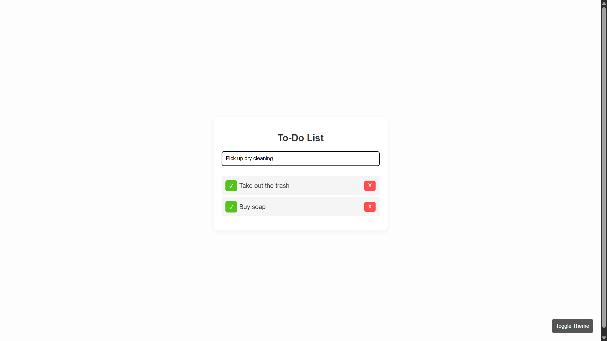
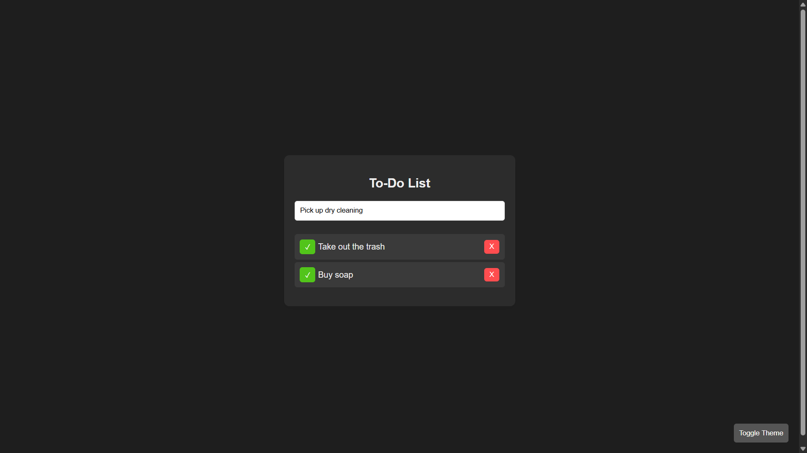

# 🚀 01 - Simple Web Projects: To-Do List (HTML, CSS, JavaScript)

[](LICENSE)


This is the first project in the **Simple Web Projects** series — a beginner-friendly, responsive **To-Do List App** built with only **HTML, CSS, and vanilla JavaScript**.

---

## ✨ Features

- Add new tasks
- Mark tasks as completed
- Delete tasks
- Edit tasks (double-click)
- Toggle **Dark/Light** mode
- Save tasks in **localStorage** (persistent)

---

## 📸 Screenshots

### Light Mode Page


### Dark Mode Page


---

## 🚀 Getting Started

1. **Clone this repository**
   ```bash
   git clone https://github.com/vishal-git-dot/01-simple-web-projects-html-css-js.git
   ```

2. **Navigate to the folder**
   ```bash
   cd 01-simple-web-projects-html-css-js
   ```

3. **Open `index.html`** in any browser

> No frameworks. No build tools. Just open and use.

---

## 🧠 JavaScript Concepts Used

| Concept                         | Description                                                                 |
|----------------------------------|-----------------------------------------------------------------------------|
| `document.querySelector()`       | Select elements from the DOM                                               |
| `getElementById()`              | Access input and button elements                                           |
| `addEventListener()`            | Handle events (`click`, `keypress`, etc.)                                  |
| `localStorage.setItem/getItem()`| Save and retrieve data from the browser                                    |
| `JSON.stringify()` / `JSON.parse()` | Store objects in localStorage as strings                              |
| `classList.add/remove/toggle()` | Dynamically add or remove CSS classes                                      |
| `createElement()` / `appendChild()` | Dynamically add DOM nodes                                               |
| `textContent` / `value`         | Get and set element text or input values                                   |
| `replaceWith()`                 | Replace a node (used for editing tasks)                                    |
| `trim()`                        | Remove whitespace from input                                               |

---

## 📚 Upcoming Projects in This Series

| #   | Project Name              | Skills                                   | Features                                               |
|-----|---------------------------|------------------------------------------|--------------------------------------------------------|
| ✅ 01 | To-Do List App          | DOM manipulation, event handling, localStorage | Add, edit, delete tasks; mark as completed         |
| 🔜 02 | Calculator              | JavaScript logic, CSS grid               | Basic arithmetic operations, responsive layout         |
| 🔜 03 | Weather App             | Fetch API, JSON, async/await             | Search city, display temperature and weather           |
| 🔜 04 | Digital Clock           | Date object, setInterval                 | Live time update, dark/light mode                     |
| 🔜 05 | Quiz App                | Event listeners, arrays, conditionals    | MCQs, score tracker, optional timer                    |
| 🔜 06 | Image Slider/Carousel   | DOM manipulation, CSS transitions        | Auto-slide, next/prev, indicators                      |
| 🔜 07 | Portfolio Website       | Responsive design, layout                | About, Projects, Contact sections                      |
| 🔜 08 | Typing Speed Test       | Timers, string comparison, DOM updates   | Random text, live WPM, accuracy                        |
| 🔜 09 | Notes App               | localStorage, event handling             | Add/delete notes, save data across sessions            |
| 🔜 10 | Rock, Paper, Scissors   | Random logic, conditionals               | Play vs. computer, show result, track score            |

---

## 🛠️ Built With

- [HTML5](https://developer.mozilla.org/en-US/docs/Web/Guide/HTML/HTML5) — semantic structure  
- [CSS3](https://developer.mozilla.org/en-US/docs/Web/CSS) — custom properties, responsive styles  
- [JavaScript](https://developer.mozilla.org/en-US/docs/Web/JavaScript) — ES6+, DOM, localStorage  

---

## 🤝 Contributing

Feel free to **fork**, open issues, or submit PRs for improvements, features, or bug fixes.

If you find this helpful, please **star ⭐** the repo — it really helps!

---

## 📄 License

This project is licensed under the **MIT License** — see the [LICENSE](LICENSE) file for details.

---

Made with ❤️ as part of a self-learning series.
